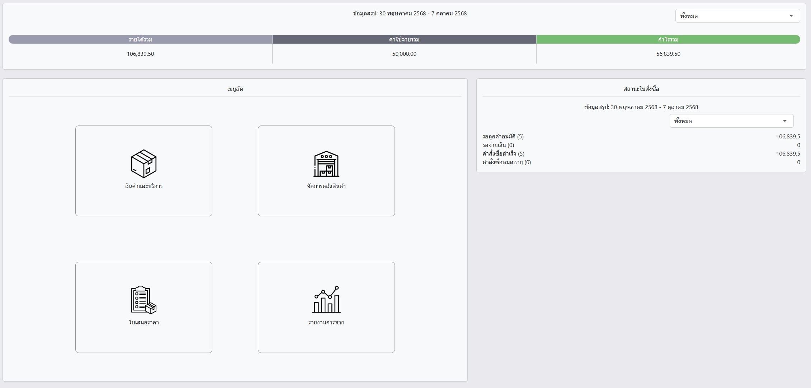
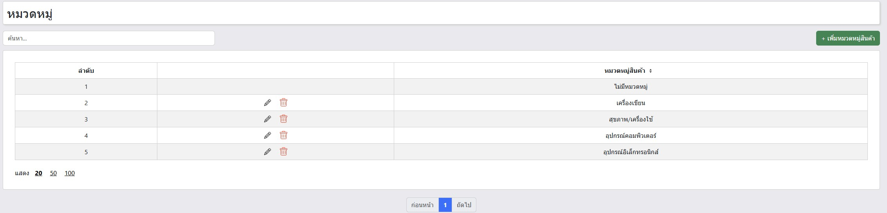
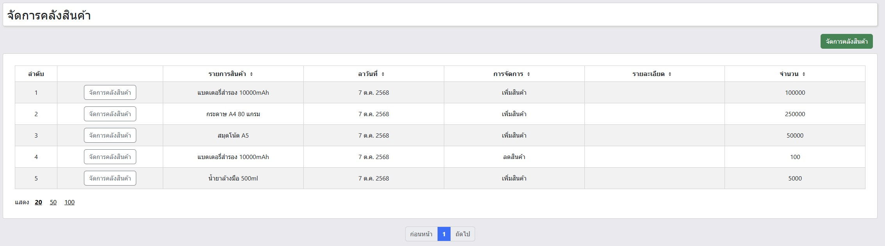
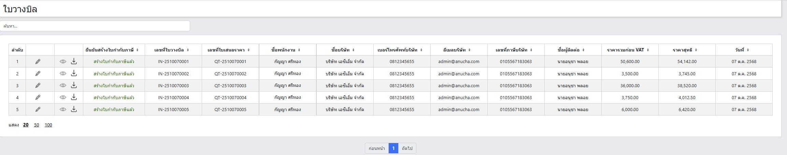
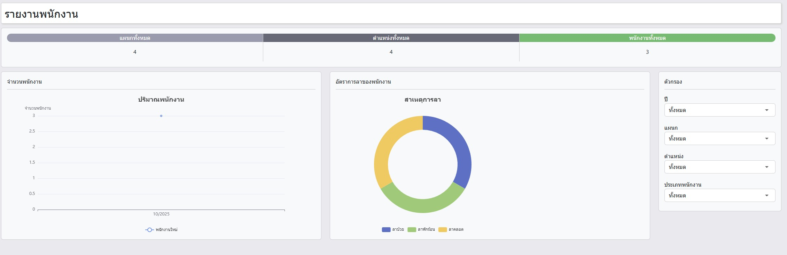
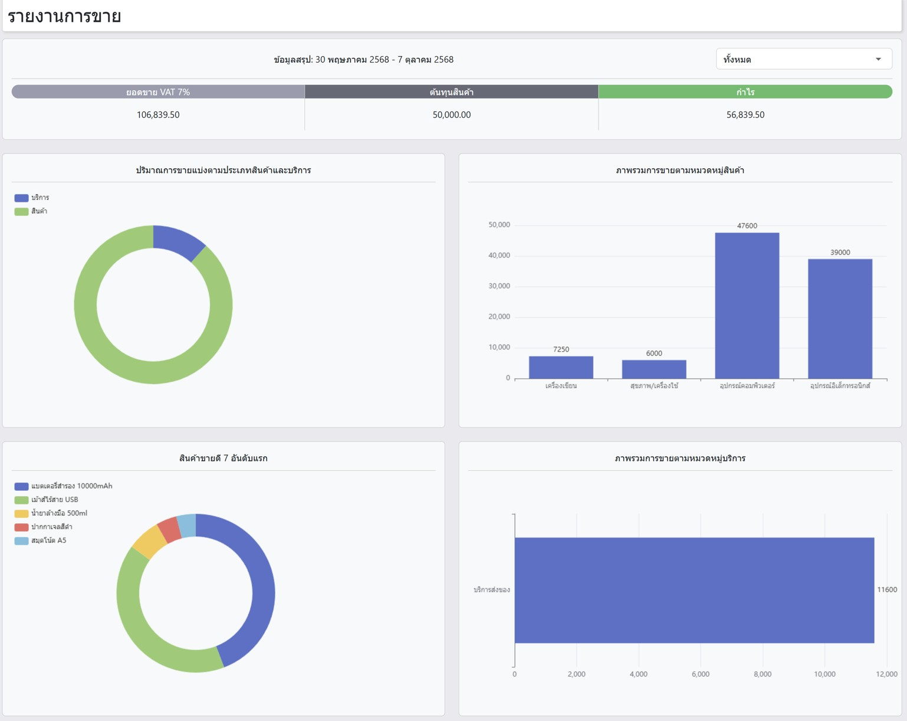
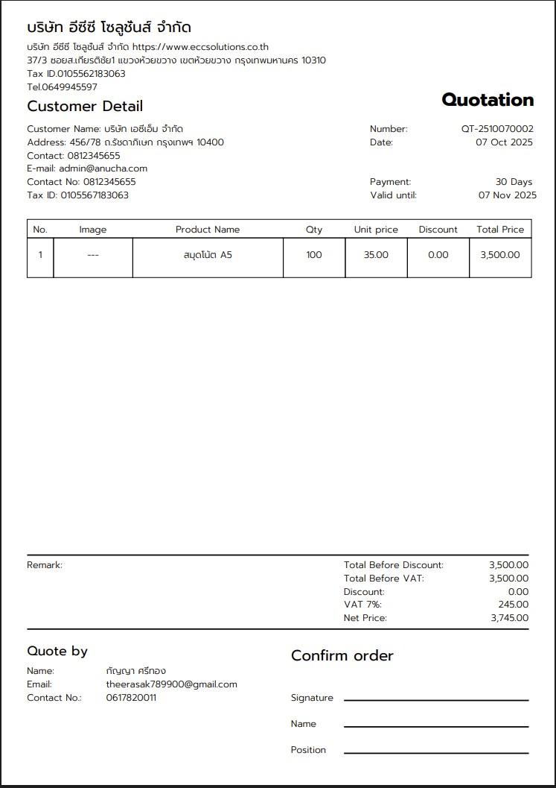

# 🚀 ระบบ ERP สำหรับจัดการธุรกิจครบวงจร


## 📖 คำอธิบาย
ระบบ ERP สำหรับจัดการธุรกิจครบวงจร รองรับการทำงานด้าน
- ✅ จัดการ **รายจ่าย** ของธุรกิจ  
- ✅ สร้างและติดตาม **ใบเสนอราคา / ใบวางบิล / ใบกำกับภาษี / ใบเสร็จ**  
- ✅ จัดการ **ลูกค้า** ทั้งบริษัทและบุคคลติดต่อ  
- ✅ จัดการ **สินค้า & บริการ**, **คลังสินค้า**, และ **หมวดหมู่สินค้า**  
- ✅ จัดการ **พนักงาน**, วันลา, แผนก, และตำแหน่งงาน  
- ✅ ระบบ **สิทธิ์ผู้ใช้งาน** และการจัดการผู้ใช้งาน  
- ✅ ดู **รายงานการขาย** และ **รายงานพนักงาน**  
- ✅ จัดเก็บและเรียกดู **ข้อมูลธุรกิจ**  
---

## 📸 ตัวอย่างหน้าจอ (Screenshots)

ภาพรวมการทำงานของระบบ:

  
*รูปที่ 1: หน้า Dashboard*


  
*รูปที่ 2: ฟอร์มเพิ่ม category ใหม่*


  
*รูปที่ 3: หน้าจัดการ เพิ่ม-ลด สต็อกสินค้า*


  
*รูปที่ 4: รายการตัวอย่าง invoice*


  
*รูปที่ 5: หน้ารายงานการลาพนักงาน*


  
*รูปที่ 6: หน้ารายงานการขาย*


  
*รูปที่ 7: ตัวอย่างใยเสนอราคา PDF*

---

## ⚙️ วิธีการติดตั้ง

1. Clone โปรเจกต์นี้ลงเครื่องของคุณ:
   ```bash 
   git clone https://github.com/ecctechs/erp_frontend.git
   cd erp_frontend


# 🖥️ วิธีใช้งานโปรแกรม ERP
1. เข้าสู่ระบบ
 - เปิดเบราว์เซอร์ แล้วกรอก Username / Password
 - กด Login เพื่อเข้าสู่หน้าหลัก

2. จัดการสินค้าและบริการ
- ไปที่เมนู สินค้า & บริการ
- กด เพิ่มสินค้าใหม่ → กรอกรหัสสินค้า, ชื่อ, ราคา, หน่วยนับ, จำนวนคงเหลือ
- สามารถแก้ไขหรือลบสินค้าได้จากหน้านี้

3. จัดการลูกค้า
- เมนู ลูกค้า (บริษัท/บุคคลติดต่อ)
- กด เพิ่มลูกค้าใหม่ → กรอกชื่อบริษัท, ที่อยู่, เบอร์โทร, เลขประจำตัวผู้เสียภาษี
- ใช้สำหรับออกเอกสารต่าง ๆ เช่น ใบเสนอราคา, ใบวางบิล

4. สร้างใบเสนอราคา
- ไปที่เมนู ใบเสนอราคา → กด เพิ่มใบเสนอราคา
- เลือกลูกค้า → เพิ่มรายการสินค้า/บริการ → ใส่ราคาและส่วนลด
- บันทึกและสามารถพิมพ์ / ส่งออกเป็นไฟล์ได้

5. ออกเอกสารการขาย
- เลือกเมนู ใบวางบิล / ใบกำกับภาษี / ใบเสร็จรับเงิน
- เพิ่มรายการตามที่ต้องการ → บันทึก
- สามารถ Export เป็น PDF หรือส่งอีเมลให้ลูกค้าได้

6. จัดการรายจ่าย
- เมนู รายจ่าย → กด เพิ่มรายจ่าย
- ใส่วันที่, รายการ, จำนวนเงิน, ไฟล์แนบ (ถ้ามี) → บันทึก

7. จัดการพนักงาน
- เมนู พนักงาน → เพิ่มข้อมูลพนักงานใหม่ (ชื่อ, แผนก, ตำแหน่ง)
- ใช้เมนู วันลา เพื่อบันทึก/อนุมัติวันลา

8. รายงาน

- เมนู รายงานการขาย หรือ รายงานพนักงาน
- เลือกช่วงวันที่ → กด แสดงรายงาน
- สามารถพิมพ์หรือส่งออกไฟล์ได้


## 🖥️ เครื่องมือที่ใช้ในการพัฒนา
1. ระบบปฏิบัติการ Windows 10
3. vue + vite 5.0.8
4. Visual Studio Code
